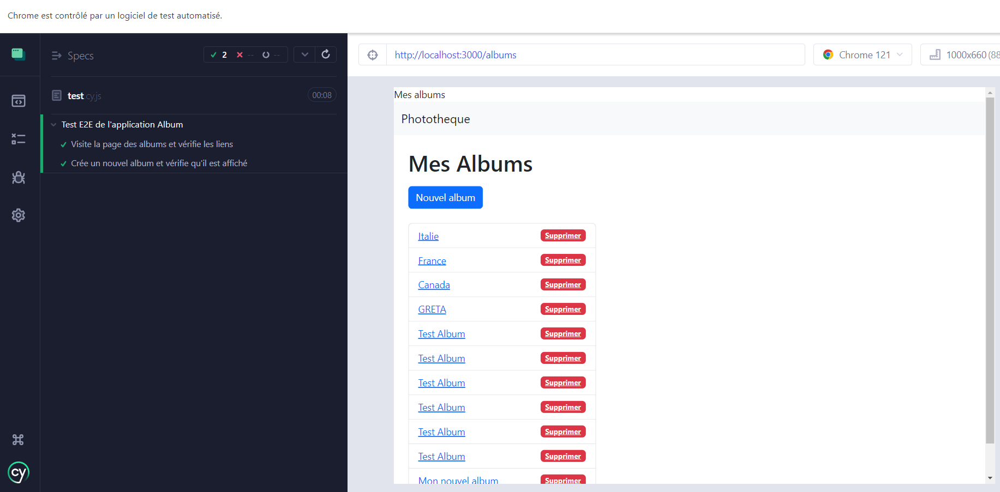
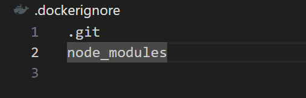

# CI/CD pipeline Projet NODE.Js

1- initialiser Git

2- remote le ref distant

```
git remote add upstream [URL]
```

2- Monter le ref distant en local

```
git pull upstream main --allow-unrelated-histories
```

3-mettre à jour les dépendances

```
npm install
```

4-tester l'app

```
node index.js
```

5-Créer un nouveau projet dans GitLab et monter notre réf vers celui-ci

```
git remote add origin https://gitlab.com/tms8285805/phototheque_project.git
```

6-Faire un commit des modifications en local puis pousser vers le ref gitLab

```
git push --set-upstream origin main
```

7-Vérifier que nous avons bien docker-compose

```
docker-compose -v
```

8-Editer le fichier de configuration de l'infrastructure docker-compose.yml et un Dockerfile puis commit et pousser vers gitLab

9-Vérifier que docker est bien lancé

```
docker info
```

10- builder docker dans notre projet

```
docker build
```

11- Demarrer vos services avec la commannde

```
docker-compose up -d
```

Cette commande démarrera tous les services définis dans votre fichier `docker-compose.yml` en arrière-plan.

12- Installer Jest pour nos test Js

```
npm install --save-dev jest

```

13-configurer package.json


* `npm run test` exécute tous les tests une fois.
* `npm run test:watch` exécute Jest en mode veille, rerun tests sur les fichiers changés.
* `npm run test:unit` exécute tous les tests avec des logs détaillés.

  13- installer supertest

  ```
  npm install --save-dev supertest
  ```

`supertest` est une bibliothèque de test pour Node.js qui permet de tester facilement les applications HTTP. Elle est souvent utilisée pour tester les applications Express.js, mais elle peut être utilisée avec n'importe quel framework HTTP.

14-Installer sinon

 `Sinon` est une bibliothèque de test pour JavaScript qui fournit des fonctionnalités pour les tests unitaires, comme les espions, les stubs et les mocks.

Voici une brève description de ces concepts :

* **Espions (Spies)** : Un espion enregistre des informations sur la fonction qu'il espionne. Il peut enregistrer combien de fois une fonction a été appelée, quels arguments ont été passés, quelle était la valeur de `this` lors de l'appel, et quelle était la valeur de retour.
* **Stubs (Bouchons)** : Un stub est une fonction qui remplace une autre fonction. Il est utilisé pour contrôler le comportement d'une fonction. Vous pouvez dire à un stub quoi retourner ou de lancer une exception à chaque fois qu'il est appelé.
* **Mocks (Simulations)** : Un mock est une fonction qui remplace une autre fonction, tout comme un stub. Cependant, un mock a des attentes préprogrammées. Par exemple, vous pouvez dire à un mock qu'il doit être appelé exactement 3 fois avec des arguments spécifiques, et le test échouera si ces attentes ne sont pas respectées.

`Sinon` est souvent utilisé en combinaison avec d'autres bibliothèques de test, comme `Mocha` ou `Jest`, pour fournir un ensemble complet d'outils pour les tests unitaires en JavaScript.

14- Editer le fichier index.test.js et configurer nos différents tests

15- tester nos fonctions depuis docker-compose

```
docker-compose up --build test
```

ou

```
npm test
```

Pour exécuter vos tests avec Jest, vous pouvez utiliser la commande suivante dans votre terminal

16 - Pour les test d'intégration et E2E (bout à bout)

Un test d'intégration est un type de test qui vérifie si différents modules ou services de votre application fonctionnent correctement ensemble. Contrairement aux tests unitaires, qui testent des parties individuelles de votre code en isolation, les tests d'intégration testent l'interaction entre différentes parties de votre code.

Par exemple, dans une application web, un test d'intégration pourrait tester le processus complet de connexion d'un utilisateur, y compris l'envoi d'une requête HTTP à l'API de l'application, la vérification des informations d'identification de l'utilisateur dans la base de données, et la réponse de l'API avec un jeton de session.

   a) installer portfinder

```
npm install portfinder
```

Le module `portfinder` est une bibliothèque Node.js qui fournit des outils pour rechercher un port réseau ouvert sur votre machine locale. Il est souvent utilisé dans les situations où vous avez besoin de démarrer un serveur sur un port spécifique, mais vous ne savez pas quels ports sont actuellement disponibles.

Dans le contexte de vos tests, `portfinder` est utilisé pour trouver un port ouvert avant de démarrer votre serveur Express. Cela permet d'éviter les conflits de port si vous avez d'autres services en cours d'exécution sur votre machine qui pourraient utiliser le même port.

b) Dans test/albumRoutes.js éditer les tests d'intégrations de nos routes

installer jest-junit

```
npm install --save-dev jest-junit
```

`jest-junit` est un reporter personnalisé pour Jest qui génère des rapports de test au format JUnit. JUnit est un format de rapport standard utilisé par de nombreux outils de CI/CD (Intégration Continue / Déploiement Continu), y compris Jenkins, CircleCI et GitLab CI/CD.

Lorsque vous exécutez vos tests avec Jest, Jest génère un rapport de test qui résume les résultats de vos tests. Par défaut, Jest génère un rapport de test dans un format lisible par l'homme. Cependant, ce format n'est pas idéal pour l'analyse automatisée des résultats des tests.

C'est là qu'intervient `jest-junit`. Lorsque vous utilisez `jest-junit`, Jest génère un rapport de test au format JUnit. Le format JUnit est un format XML standard qui peut être analysé par de nombreux outils de CI/CD. Cela permet à ces outils de comprendre les résultats de vos tests et de fournir des informations détaillées sur les tests qui ont réussi et ceux qui ont échoué.

En résumé, `jest-junit` est utile si vous souhaitez intégrer vos tests Jest dans un pipeline de CI/CD et obtenir des rapports de test détaillés.

c) Ajouter le job test_integration à .gitlab-ci.yml

d) Ajouter le test à script dans package.json

16- Mettons maintenant en place un test E2E

a) Installer cypress

```
npm install --save-dev cypress
```

b) créer un fichier cypress/e2e/test.cy.js

c) éditer le fichier cypress.json

d) tester votre intégration en local

```
npx cypress open
```

Cypress va prendre le relais et faire le test pour nous

(lancer le server node au préalable)



e) tester en local

Si nous souhaitons supprimer toutes les images, vider la cache Docker afin de les réconstruire

```
docker system prune -a
```

* redemarrer les Docker desktop
* Nous pouvons ensuite reconstruire et demarrer le service app

```
docker-compose up --build app
```

* Pour lancer notre test cypress avec notre container cypress depuis docker

  ```
  docker run --network=host -it -v //c/dev_web/DEVOPS/devOps_project/node_project:/e2e -w //e2e cypress/included:6.0.0
  ```
* `--network=host` : Cela fait en sorte que le conteneur utilise le réseau de l'hôte. C'est utile lorsque vous voulez que le conteneur communique avec d'autres services sur le même hôte.
* `-it` : Cela signifie que Docker doit allouer un pseudo-TTY et garder l'entrée standard ouverte. C'est utile lorsque vous voulez interagir avec le conteneur.
* `-v //c/dev_web/DEVOPS/devOps_project/node_project:/e2e` : Cela mappe le répertoire `//c/dev_web/DEVOPS/devOps_project/node_project` sur votre machine hôte au répertoire `/e2e` dans le conteneur. C'est utile lorsque vous voulez que le conteneur ait accès aux fichiers sur votre machine hôte.
* `-w //e2e` : Cela définit le répertoire de travail dans le conteneur à `/e2e`. C'est utile lorsque vous voulez que les commandes exécutées dans le conteneur soient exécutées dans ce répertoire.
* `cypress/included:6.0.0` : C'est l'image Docker que vous voulez exécuter. Dans ce cas, c'est l'image `cypress/included` avec la balise `6.0.0`.

Si jamais votre build ne fonctionne pas, cela pourrais être du au poid de votre fichier, pour l'alléger, vous pouvez éditer un fichier .dockerignore



Si vous souhaitez arreter tous les processus docker encours

```
docker stop $(docker ps -a -q)
```

18 - test la qualité de notre code

    a) installer ESLint : afin de pouvoir lister nos éxigeances

```
npm install eslint --save-dev
# ou
yarn add eslint --dev
```

 b) initialiser la configuration Eslint

```
npx eslint --init
# ou
yarn run eslint --init
```

c) afin de pouvoir tester également  tous les fichiers et également ceux de configurations, nous devons ajouter un certains nombre de plugins à eslint afin qu'il sache à quoi servent certaines variables dans notre code

```
npm install --save-dev eslint-plugin-cypress
npm install --save-dev eslint-plugin-jest
```

d) Pour ESLint, vous pouvez spécifier les fichiers à analyser en ajoutant un script dans votre fichier `package.json` :

```
"scripts": {
  "lint": "eslint ."
}
```

e) analyser notre code

```
npx eslint .
```

f) corriger les erreurs signalées :

    album_controller.js , index.js, cypress.config.js, test.cy.js

A savoir :

    - Si vous souhaitez rentrer dans le conteneur docker

```
docker run -it --entrypoint /bin/bash <nom_de_votre_image>
```

19 - Ajouter le job test_AQ à nos différentes infrastructures as code

20 - Créer un fichier .eslintignore afin de ne pas intégrer les fichires qui sont dans le dossier cypress pour nos tests de qualité

21 - Après avoir édité nos tests d'intégration, nous pouvons maintenant commencer le CD

    1- installer mocha :

```
npm install --save-dev mocha
```

Mocha est un framework de test populaire pour Node.js. Il est utilisé pour tester des applications synchrones et asynchrones pour s'assurer qu'elles fonctionnent comme prévu.

Voici quelques caractéristiques de Mocha :

* **Tests asynchrones** : Mocha a un excellent support pour les tests asynchrones, ce qui est crucial pour tester les applications Node.js qui sont fortement basées sur des opérations asynchrones comme la lecture de fichiers ou les requêtes HTTP.
* **Rapports flexibles** : Mocha a un système de rapport flexible qui peut être personnalisé avec des reporters supplémentaires. Il peut générer des rapports dans différents formats comme le HTML, le JSON, etc.
* **Hooks** : Mocha fournit des hooks comme `before`, `after`, `beforeEach` et `afterEach` qui peuvent être utilisés pour configurer les conditions avant et après les tests ou les suites de tests.
* **Support de plusieurs interfaces** : Mocha supporte plusieurs interfaces de style de test comme BDD (Behaviour Driven Development), TDD (Test Driven Development), QUnit, etc.

    2)	Ajouter le script "test_env" dans package.json afin de lancer nos test d'environnement
