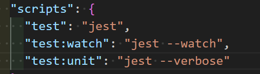

# CI/CD pipeline Projet NODE.Js

1- initialiser Git

2- remote le ref distant

```
git remote add upstream [URL]
```

2- Monter le ref distant en local

```
git pull upstream main --allow-unrelated-histories
```

3-mettre à jour les dépendances

```
npm install
```

4-tester l'app

```
node index.js
```

5-Créer un nouveau projet dans GitLab et monter notre réf vers celui-ci

```
git remote add origin https://gitlab.com/tms8285805/phototheque_project.git
```

6-Faire un commit des modifications en local puis pousser vers le ref gitLab

```
git push --set-upstream origin main
```

7-Vérifier que nous avons bien docker-compose

```
docker-compose -v
```

8-Editer le fichier de configuration de l'infrastructure docker-compose.yml puis commit et pousser vers gitLab

9-Vérifier que docker est bien lancé

```
docker info
```

10- builder docker dans notre projet

```
docker build
```

11- Demarrer vos services avec la commannde

```
docker-compose up -d
```

Cette commande démarrera tous les services définis dans votre fichier `docker-compose.yml` en arrière-plan.

12- Installer Jest pour nos test Js

```
npm install --save-dev jest

```

13-configurer package.json



* `npm run test` exécute tous les tests une fois.
* `npm run test:watch` exécute Jest en mode veille, rerun tests sur les fichiers changés.
* `npm run test:unit` exécute tous les tests avec des logs détaillés.

  13- installer supertest

  ```
  npm install --save-dev supertest
  ```

`supertest` est une bibliothèque de test pour Node.js qui permet de tester facilement les applications HTTP. Elle est souvent utilisée pour tester les applications Express.js, mais elle peut être utilisée avec n'importe quel framework HTTP.

14-Installer sinon

 `Sinon` est une bibliothèque de test pour JavaScript qui fournit des fonctionnalités pour les tests unitaires, comme les espions, les stubs et les mocks.

Voici une brève description de ces concepts :

* **Espions (Spies)** : Un espion enregistre des informations sur la fonction qu'il espionne. Il peut enregistrer combien de fois une fonction a été appelée, quels arguments ont été passés, quelle était la valeur de `this` lors de l'appel, et quelle était la valeur de retour.
* **Stubs (Bouchons)** : Un stub est une fonction qui remplace une autre fonction. Il est utilisé pour contrôler le comportement d'une fonction. Vous pouvez dire à un stub quoi retourner ou de lancer une exception à chaque fois qu'il est appelé.
* **Mocks (Simulations)** : Un mock est une fonction qui remplace une autre fonction, tout comme un stub. Cependant, un mock a des attentes préprogrammées. Par exemple, vous pouvez dire à un mock qu'il doit être appelé exactement 3 fois avec des arguments spécifiques, et le test échouera si ces attentes ne sont pas respectées.

`Sinon` est souvent utilisé en combinaison avec d'autres bibliothèques de test, comme `Mocha` ou `Jest`, pour fournir un ensemble complet d'outils pour les tests unitaires en JavaScript.

14- Editer le fichier index.test.js et configurer nos différents tests

15- tester nos fonctions depuis docker-compose

```
docker-compose up --build test
```

ou 

```
npm test
```

Pour exécuter vos tests avec Jest, vous pouvez utiliser la commande suivante dans votre terminal
